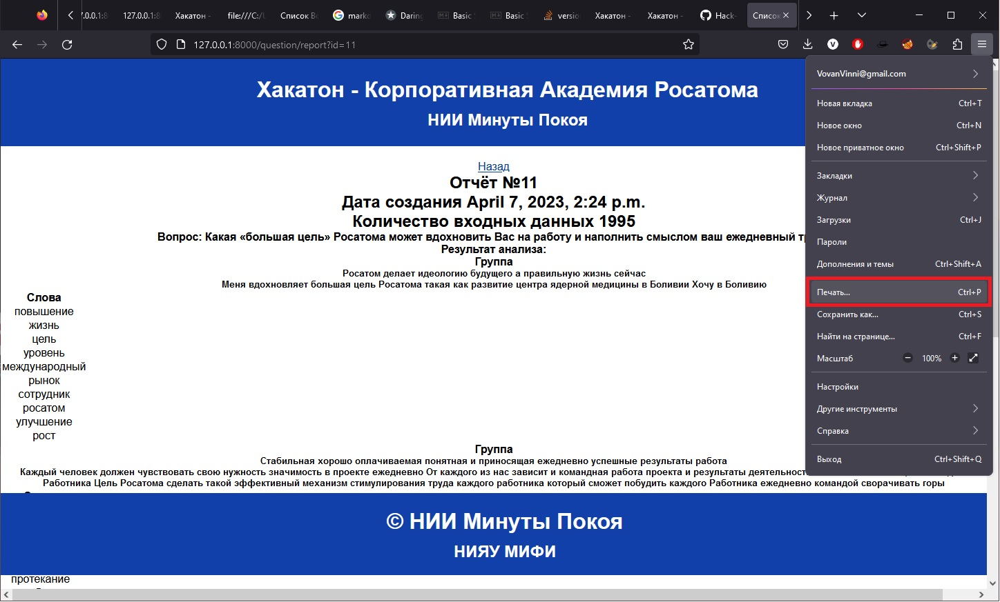
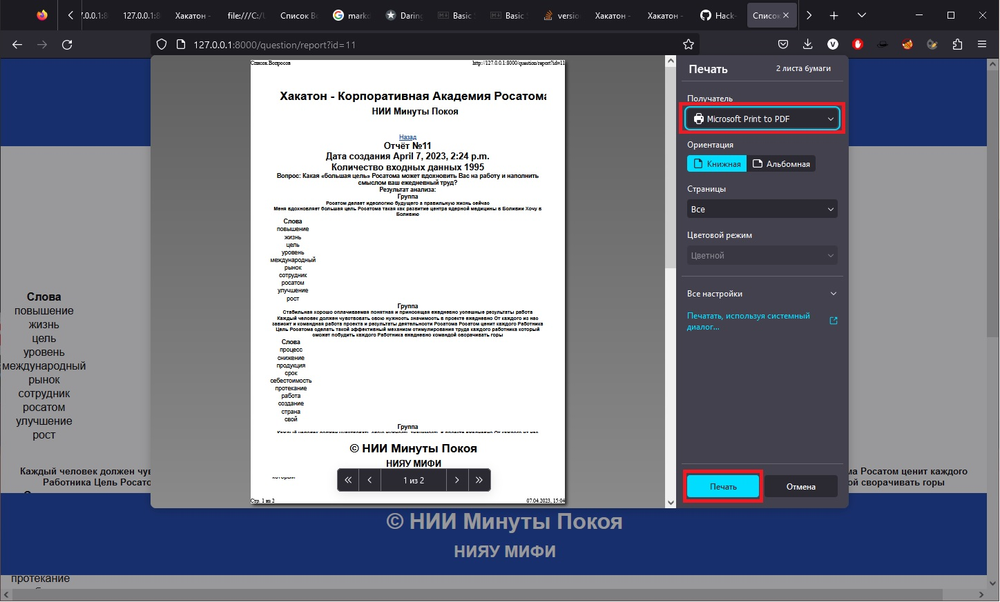

# Hack-a-tone-2023
Анализ ответов респондентов на вопрос. (С возможностью импорта из xls и редактирования информации внутри приложения)

# Запуск проекта (Сервер Debian)

## Клонируем проект, в директорию ~

    git clone https://github.com/Nii-Minuts-of-Rest/Hack-a-tone-2023.git

## Устанавливаем пакет для создания виртуального окружения

    sudo apt-get update && sudo apt-get upgrade
    sudo apt install virtualenv

## Создаём виртуальное окружение

    mkdir ~/python-environments && cd ~/python-environments
    virtualenv --python=python3 env
    source env/bin/activate

## Возвращаемся в папку проекта

    cd ../Hack-a-tone-2023/

## Устанавливаем зависимости проекта

    pip install django
    pip install pandas
    pip install sklearn
    pip install scikit-learn
    pip install gensim
    pip install nltk
    pip install pymorphy2
    pip install openpyxl

## Выполняем создание базы данных

    python manage.py migrate

## Запускаем сервер

    python manage.py runserver 0.0.0.0:8000

### Тестовый xls для импорта находится в **корне** репозитория
------
# Экспорт результатов (Браузер Firefox)

## Для экспорта результатов сканирования необходимо открыть страницу с результатами и в браузере Firefox выбрать **Печать**. Приведено на рисунке ниже.

## После этого откроется окно с настройками печати. Необходимо выбрать в качестве получателя **Microsoft Print to PDF** и нажать на кнопку **печать**

